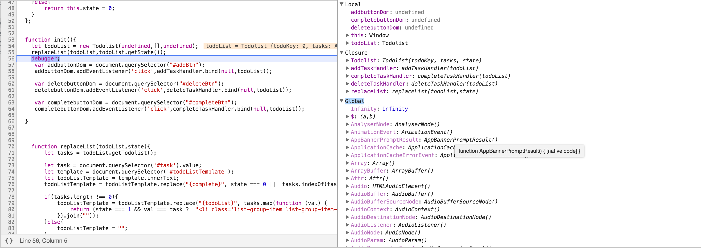
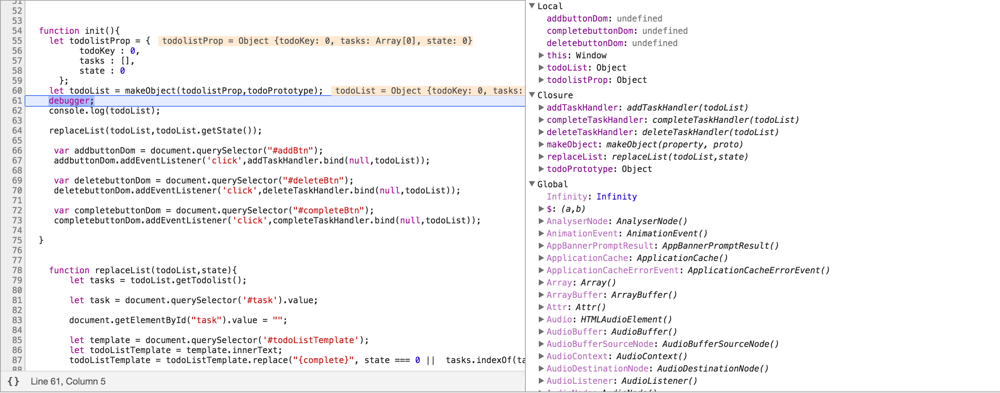
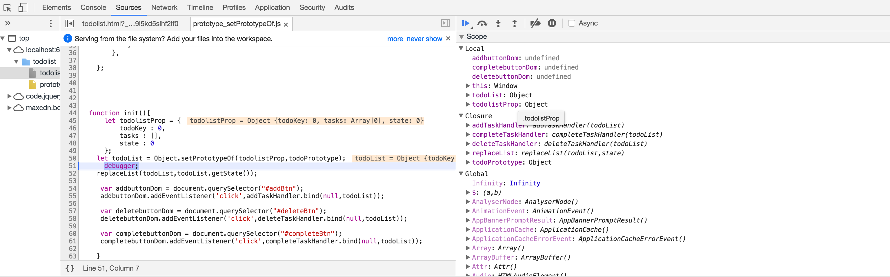
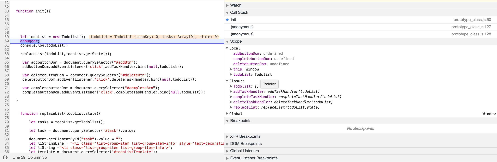

## 170316

### 코드리뷰
1. 삼항 연산자의 길이는 길면 좋지 않다. 리턴을 한번에 해주면 디버깅 하기 어렵다.
2. 자바스크립트 클래스를 사용한 라이브러리를 확인한다.
3. 프로토타입을 사용시에 하나씩 정의 해 놓는 것 보다 하나의 객체에 함수를 모두 정의 해 놓은 후 덮어쓰는 방식이 좋을 수 있다.
4. major 회사일 수록 pure한 코드를 쓴다.
5. **new, createObject, setPrototypeOf, class의 탄생 배경 공부** -> 어떤 차이점이 있는지 확인.
- new

- createObject

- setPrototyeOf

- class

