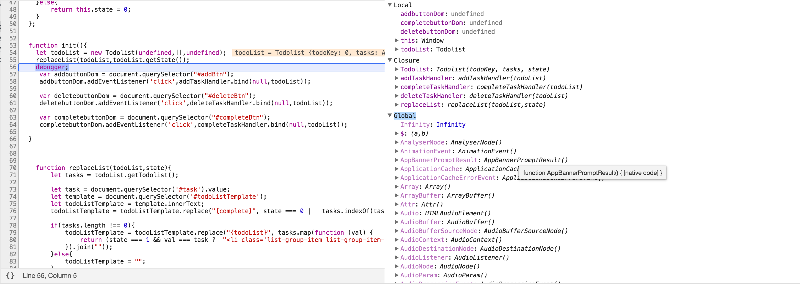
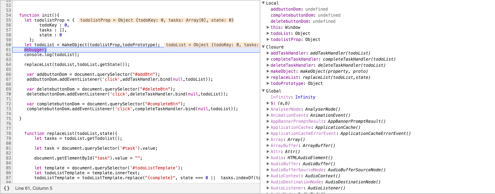
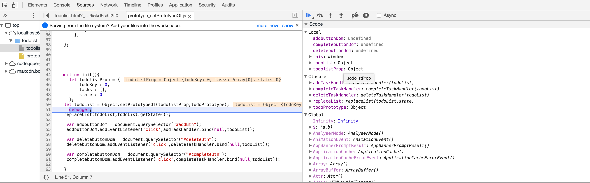
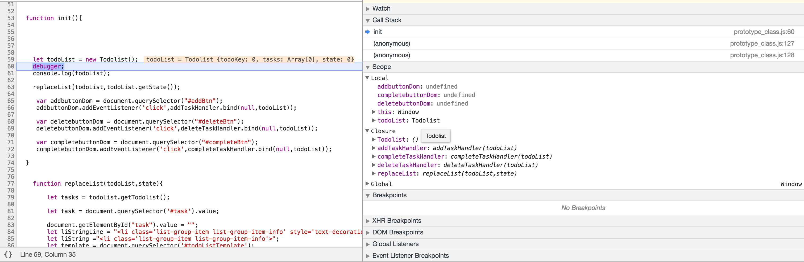

## 170316

### 코드리뷰
1. 삼항 연산자의 길이는 길면 좋지 않다. 리턴을 한번에 해주면 디버깅 하기 어렵다.
2. 자바스크립트 클래스를 사용한 라이브러리를 확인한다.
3. 프로토타입을 사용시에 하나씩 정의 해 놓는 것 보다 하나의 객체에 함수를 모두 정의 해 놓은 후 덮어쓰는 방식이 좋을 수 있다.
4. major 회사일 수록 pure한 코드를 쓴다.
5. **new, createObject, setPrototypeOf, class의 탄생 배경 공부** -> 어떤 차이점이 있는지 확인.
- new

- createObject

- setPrototyeOf

- class

## 실습
1. 어제 내용을 가지고 작성한다.
2. 화면은 3개로 나누어져 있다. 메뉴, 리스트, 뉴스 내용 view 단위로 나눌수 있다.
 - 메뉴객체, 리스트객체, 뉴스객체로 나누어 사용한다.
3. 뉴스 내용을 데이터로 지정한다.(순수한 데이터) -> 모델 object, 의도적으로 프로토타입을 넣는다.
4. 어디에서나 쓰는 것을 **utility** 라하며 리터럴 데이터로 만든다.
~~~
  util = {
    ajax :
    $ :
    ...
  }
~~~
5. 모든 메소드는 주석을 다는 것이 좋다.
6. 스켈레톤 코드를 한다.
