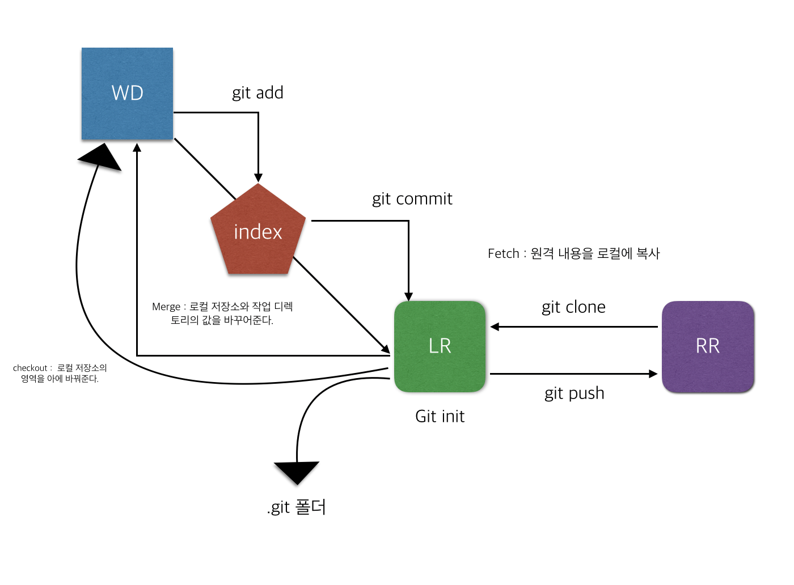
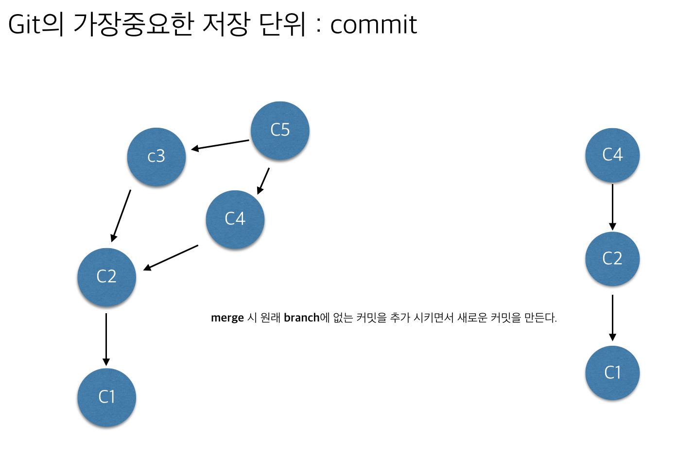

### Git 정리

#### git의 기본 적인 구조

> 

####  git init / clone
- 로컬 레퍼지토리를 만들어주는 명령어
- git clone 원본 저장소 [디렉토리 이름]
> clone시 해당 프로젝트 내용이 복사 된다. 옵션으로 디렉토리 이름은 넣어 원하는 폴더에 해당 프로젝트를 복사할수 있다.

#### head
- 내가 작업하고 있는 커밋

#### git commit / merge

> 

- merge는 공통부분을 두고 나머지를 합치며 새로운 commit이 하나 더 생긴다.
- merge는 두 브렌치를 합쳐서 하나의 커밋을 만든다.
- 일반적으로 master로 checkout 한 후 merge 한다.
- `commit은 git 저장의 가장 중요한 단위이다.`
- tip. merge시 충돌이 난다면 아래의 예제처럼 표시 된다.
~~~
 <<<<<<<<<< <- head의 내용
 1234
 2134
 ==========
 5544
 3321
 >>>>>>>>>> <- merge할 대상
~~~
- 개발자가 직접 보고 처리해 주어야 한다.

#### git branch
- master : 기본 브렌치, 보통 master브렌치에서 많은 작업이 이루어진다.

#### git checkout
- 원하는 커밋으로 이동이 가능하다.
- brach, master 없이도 원하는 commit으로 이동 가능하다.
- head는 branch에 속해 있지 않기 때문에 꼭 checkout을 해주어야 한다.
- tip. 원하는 부모/자식 commit으로 head를 이동 시키고 싶다면?

> 부모로 이동 : git branch -f [현재 브렌치/commit] [옮길 브렌치/commit]

> 자식으로 이동 : git merge [옮길 브렌치/commit]

#### git config --global 변수명
- git에 대한 여러 설정을 할수 있다.
- global도 가능하며 현재 프로젝트의 .git 폴더안에 있는 config파일 설정도 가능하다.
- tip. alias 옵션을 통해 많이 쓰는 명령어를 편하게 사용 가능하다.
`git config ‐‐global alias.co commit` 이렇게 commit 명령어를 co만 사용하여 실행 시킬 수 있다.
