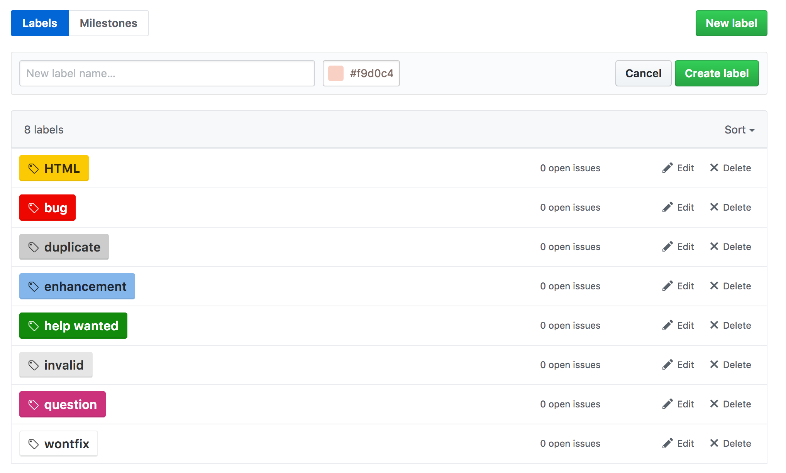
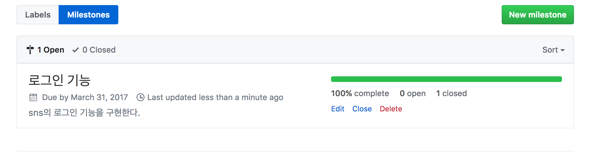
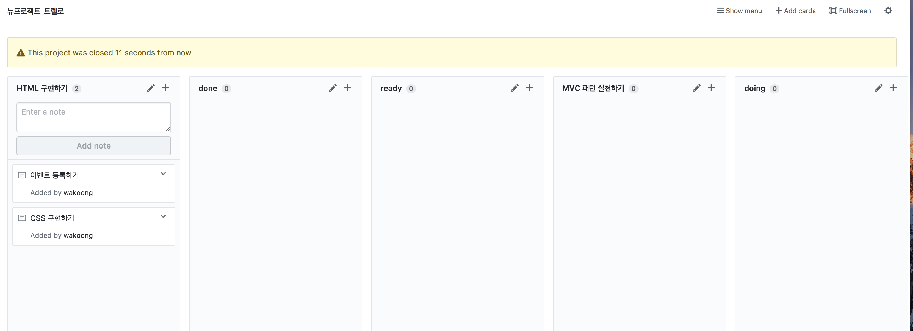

## 170327

#### 추천 도서
- 속깊은 자바스크립트
- 디자인 패턴 도서 검색

#### 팀프로젝트
- 팀프로젝트는 아주 어렵다.
- 일처럼 하는 것이 아니라 배우는 입장에서 프로젝트를 진행하면 진행 속도가 느릴수 밖에 없다.
- 프로젝트 기간 동안 계속 배우는 것이 중요 하다.
- 하려는 목표를 꼭 달성해야 한다.
- 주어진 조건에 맞춰 프로젝트를 진행 해야한다.
- 협업의 중요성을 아는 것이 중요하다. 협업 시에 느낀점을 잘 작성해 놓는 것이 좋다.
- 배운것을 회고 하면서 계속 개선 방법을 찾아야 한다.
- 배운 지식을 프로젝트를 통해서 자기것으로 한다. (배운 기반의 기술을 사용 하는 것이 중요하다.)
- 협력(같이 성장 하는 것이 중요), 피드백(서로간의 피드백을 주는 것도 중요), 즐거움(즐거움을 만들수 있는 장치를 만들 수 있다.)

#### 팀 빌딩 (김동현, 김휘겸, 궁우식)
- SNS 프로젝트
- 벤치마킹 : 페이스북, 인스타 그램
- 데일리 커밋 (궁금한점, 목표, 완성, 실패, 회고등...)

#### 피드백
1. 동현
  - 경험이 있어서 알려주는 것은 좋으나 조급해 하지 않았으면 좋겠습니다.
  - 대화가 많았으면 좋겠다.
  - 계속 하는 스타일, 한가지에 집착하는 스타일.

2. 휘겸
  - 다 좋다, 밝은 분위기!!! 같이 열심히 할수 있을 거 같다.
  - 짧게 짧게 집중 하는 스타일, 사이클 규칙적으로
  - 야근은 힘들다.

3. 우식
  - 못한다고 생각 안해도 된다.
  - 시간 적인 제약은 없는 편이다. 목표가 안보이면 인내심이 끊긴다.
  - 목표가 보이면 계속 하는 스타일, 관리를 통해 어느 정도 구현 할수 있는지 말해 주면 좋겠다.

#### 개인이 하고 싶은 3가지
1. **동현**
  -
  -
  -

2. **휘겸**
  -
  -
  -

3. **우식**
  -
  -
  -

#### 좋은 팀이 되기 위한 조건 3가지
1. **동현**
  -
  -
  -

2. **휘겸**
  -
  -
  -

3. **우식**
  -
  -
  -

#### 뉴스스탠드의 개발 항목 추출
- 백로그 : 해야될 일을 나열 하는 것이다.
- 기획서를 보고 개발자가 해야 할 일에 대한 작업 이름, 작업 상세 , 사용 언어 , 담당자 등을 나누어 작성
- 개발 상세(feature)별로 개발 완료에 대한 조건을 써둔다. 키값을 넣어준다. 이슈나 완료시에 업로드 가능하다.
- 최대한 자세하게 작성한다.
- 백로그 작성 룰 : 

#### 개발 완료 조건(test 시나리오, test case)
- 하나의 피처에 대한 완료 조건을 자세히 써주어야 한다.
- 완료되었는지 되지 않았는지 확인 할수 있어야 한다.
- 어떤 테스트를 수행 해야 하는지 자세히 써 놓는다. 
- 스타일에 대한 내용도 작성 할수 있다면 자세히 작성하는 것이 좋다. ex) px 등...
- UI가 제공되면 더욱 자세히 작성할 수 있다.
- 비UI 내용은 설계된 내용을 기반으로 유닛테스트케이스를 만들어 테스트를 진행 할수 있다.
   Ex) 어떤 데이터가 들어가고 어떤 형식으로 전달 되어야 하는지 작성 할 수도 있다.
- feature를 최대한 자세히 나누어야 예상을 하기 쉽다.
- **개발 완료 조건 작성 룰 **
  - 사용자 관점에서 작성한다. 일반 사람이 보더라도 이해할 수 있도록 작성한다.
  - 개발자 언어를 사용 하지 않는다. ex) 데이터, ajax, db, 라우팅 등의 단어 금지
  - 테스트 순서를 숫자로 표시한다. ex) 1. 블라블라
  - 해당 기능에 대한 내용만 작성한다. 
  - 최대한 자세히 작성한다. ex) 2. 우 클릭 버튼을 누르면 다음 기사가 전환효과 없이 노출된다 , **뿌려진다. 나온다 라는 추상적인 내용은 최대한 지양한다.**
  - 개발자가 알수있도록 자세히 작성한다.

#### feature(issue)별로 얼마나 개발에 소요
- 한 feature를 만드는데 걸리는 시간을 작성한다.
- 한주의 예상 시간을 작성한다.
- 예상과 완료된 시간을 비교한다. 예상 시간과 완료 시간에 대한 gap을 줄인다. 
   Ex) burndown chart

#### github를 이용한 issue tracker
- **이슈 제목에 대한 룰을 정해야한다.**
- 서로 진행 상테에 대해 댓글도 달수 있다. 
- label은 마음대로 작성가능하다. 원하는 라벨을 작성하여 표시 가능.
- 상태 업데이트를 계속 해야 한다.
- 중요도(major...), 난이도(high...)등 다양하게 나눌수 있다.
> 

- milestone은 프로젝트 진행의 지표이다. 계획을 작성한다. 
> 

- 프로젝트를 통해 트렐로 처럼 사용할 수 있다.
> 

- wiki 사용
   위키를 통해 다양한 규칙이나 내용을 정리해서 관리 할수 있다.

#### 프로젝트 관리
1. versition control system
   github
2. Issue/Feature tracker
   github issue
3. Task manager
   github project
4. team communication
   slack
5. document
   google docs

#### 공통 룰
1. 매일 오전에 10분수준의 스탠드업 미팅을 한다. (업무보고가 아니다)
 어제한일
 오늘할일
2. 도움이 필요한 것을 짧게 공유한다.
3. 매일 오후에 회고(느낀점) 미팅을 한다.
4. 우리팀 활동에 대해 잘한점, 개선할점을 이야기하기.
5. **팀이 모든 것을 변경할 수 있고, 지속적으로 개선하려고 노력** -> 여러가지 시도를 해야 한다.
	비효율 적인 방법은 버리고 필요한 방법을 찾고 개선 한다.

#### 다른조의 의견
1. **3조**
  - 루틴을 중요시 여기자. 하루의 목표나 내용을 서로 공유 할 수 있는 것이 좋겠다.
  - pair 리뷰를 했으면 좋겠다.
  - 최종 목표를 정해 놓고 하면 좋겠다.

2. **2조**
  - 회고의 중요성.
  - 상대방에게 자신에 대해 말해 주는 것.

3. **1조**
  - 소통 : 좋고 싫음을 명확하게 소통 했으면 좋겠다.
  - 협력 : 상부 상조하는 공생 관계
  - 책임감 : 맡은 일에대한 책임감을 가진다.

4. **5조**
  - 소통
  - 리뷰 및 회고
  - 싸우지 말자

5. **4조**
  - 배우려는 자세 : 모르는것에 대해 질문을 하자
  - 소통
  - 일정에 대한 공유

#### 참고
- jQuery의 사용 이유가 너무 줄었다. 라이브러리와 프레임 워크에 대한 이야기를 할 것.
