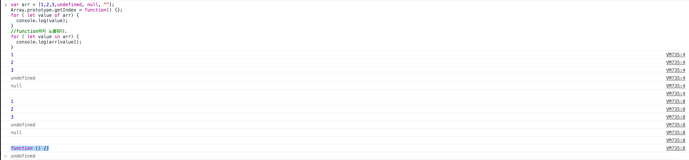
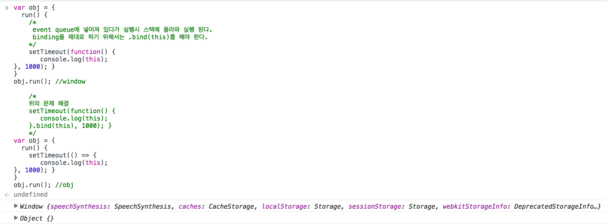

## 170405

#### ES6
- 브라우저 지원 이슈로 인해 우리나리의 많은 회사에서 사용하지는 못하는 기술 
- 외국에서는 많이 사용한다.
- 자바스크립트 표준이다.
- es5 -> es6 : 가장 큰 변화가 있었다.
- 개선된 JavaScript문법.
- 모바일도 많이 지원한다.
- react 에서 es6 를 많이 사용한다.

#### let
- ES6에서는 let 키워드를 사용해서 변수를 선언하면, Block({})단위의 scope를 만들 수 있다.
- 블록 스코프를 만들기 위해 사용.
~~~javascript
var name = 'play ground';
function home() {
  var homeName = 'my house';
  for (let i = 0; i<1000; i++){}
  console.log(i); //i is not defined
}
~~~
- 위의 예제에서 let으로 i를 선언 했기 때문에 블록 밖에서는 i를 사용 할수 없다.

#### const
- const를 기본으로 쓰는 것이 좋고 문제가 생길시 let 사용.
- 변경되지 않을 값일 경우 const를 사용 하면된다.
- const와 let은 scope에 대한 이해가 명확히 있어야 한다.
- 배열을 mutable하다. 원본 배열을 바꾸지 바꾸지 않기 위해서 복사해서 사용한다.
- const를 사용한다고 수정할 수 없음을 의미하는 것은 아니다. const를 사용하더라도 배열과 오브젝트의 값을 변경하는 것은 가능.
- react의 경우 이전 상태나 현재 상태의 변경 됨을 확인하고 뷰에 반영하는 방식을 사용한다.

~~~javascript
const list = ['john', 'adele', 'hary'];
list2 = [].concat(list, "tiger");
list == list2; //false
~~~

- 위의 예제에서 list와 list2의 참조가 다르기 때문에 false가 나온다.

#### String enhancements (브라우저 지원 범위 확인)

1. startsWith() 
- str.startsWith(searchString[, position])
- 이 메소드는 어떤 문자열이 특정 문자로 시작하는지 안 하는지를 확인 할 수 있다. 이 메소드는 대소문자를 구분한다.
- 파라미터 : searchString 문자열 : 시작에서 검색 됐으면 하는 문자
- position 옵션 : searchString를 찾기 시작 할 문자열의 시작 위치. 기본은 0.
- 반환 값 : 문자열이 검색 문자의 문자로 시작하면 true 이고 아니면 false
~~~javascript
//startswith
var str = 'To be, or not to be, that is the question.';

console.log(str.startsWith('To be'));         // true
console.log(str.startsWith('not to be'));     // false
console.log(str.startsWith('not to be', 10)); // true

//polyfill
if (!String.prototype.startsWith) {
    String.prototype.startsWith = function(searchString, position){
      position = position || 0;
      return this.substr(position, searchString.length) === searchString;
  };
}
~~~

2. endsWith()

3. includes()

#### Array enhancements - for/of
1. for in 은 자신이 가지고 있지 않은 것도 순회한다.
- prototype까지 모두 탐색한다. 혹시 바뀐 것이 있는가?
- hasOwnProperty를 사용하여 객체나 배열을 for in 을 통해 탐색 한다.

2. for of 는 자신이 가지고 있는 property만 확인한다.
3. for/of는 string에서도 사용 가능
- 예제
~~~javascript
var arr = [1,2,3,undefined, null, ""];
Array.prototype.getIndex = function() {};
for ( let value of arr) {
  console.log(value);
}
//function까지 노출된다.
for ( let value in arr) {
  console.log(arr[value]);
}
~~~
- 결과
> 

#### Array enhancements - spread operator
- 펼침 연산자
- 원본을 유지하면서 다른 작업을 하고 싶을때 많이 사용한다.
- 히스토리를 추적 할수 있다. 되돌리기 기능
- 배열을 펼처서 작업 가능
1. 새로운 배열로 쉽게 복사할 수 있다.
- 참조가 아에 달라진다. 값이 아에 달라지는 것이다.
~~~javascript
let previousData = ["apple", "orange", 100, 200];
let newData = [...previousData];
console.log(newData === previousData); //false
~~~

2. 배열 합치기가 쉽다.
- concat과 같이 원본 배열에 합칠 수도 있다. 
~~~javascript
let previousData = ["apple", "orange", 100, 200];
let newData = [1,2,3,...previousData];
console.log(newData); //[1, 2, 3, "apple", "orange", 100, 200]
~~~
- `let newData = [1,2,3,...previousData];` : `...` 이 없다면 이중배열이 들어가는 것이다. 

3. 배열을 func&on에 개별 파라미터로 전달하기가 쉽다.
- func의 파라미터로 배열을 ... operator를 사용하여 전달하면 순서대로 하나씩 전달 된다. 
~~~Javascript
function sum(a,b) { return a+b}
const arr = [4423,42];
//sum.apply(null, arr);
sum(...arr);
~~~
- 배열 형태의 파라메터를 전달 할때 유리 하다.

#### Array enhancements - methods
1. from 
- https://developer.mozilla.org/en-US/docs/Web/JavaScript/Reference/Global_Objects/Array/from
- 모든 객체, 배열, string등을 모두 배열로 바꿔 준다.
- 함수의 arraylike 객체인 arguments를 쉽게 array로 바꿀수 있다.
- 이전 : Array.prototype.slice.call(arguments);
- 현재 : Array.from(arguments)
- nodeList를 배열로 바꿔 줄때도 유용하다.

- 예제 
- string에 사용
~~~
Array.from('foo'); 
// ["f", "o", "o"]
~~~
- set collection에 사용
~~~javascript
var s = new Set(['foo', window]); 
Array.from(s); 
// ["foo", window]
~~~

- map collection에 사용
~~~javascript
var m = new Map([[1, 2], [2, 4], [4, 8]]);
Array.from(m); 
// [[1, 2], [2, 4], [4, 8]]
~~~

- Array-like object (arguments)에 사용
~~~javascript
function f() {
  return Array.from(arguments);
}

f(1, 2, 3);
// [1, 2, 3]
~~~

- Using arrow functions and Array.from
~~~javascript
// Using an arrow function as the map function to
// manipulate the elements
Array.from([1, 2, 3], x => x + x);      
// [2, 4, 6]
// Generate a sequence of numbers
// Since the array is initialized with `undefined` on each position,
// the value of `v` below will be `undefined`
Array.from({length: 5}, (v, i) => i);
// [0, 1, 2, 3, 4]
~~~

#### Object enhancements
- 객체를 쉽게 생성.
- `getName() { return this.name; }` 와 같이 function 키워드를 생략 할 수 있다.

~~~javascript
const name = "nayoun";
const age = 9;
const others = {
   address : "kwang myeung city",
   tel : null,
   height: 130
}
const data = {
   name,
   age,
   others,
   getName() {
      return this.name;
   }
}
console.log(data.getName());  //nayoun
~~~

#### Destructuring
- 배열의 내용중 해당 인덱스에 있는 값을 `[,,applecount, orangecount]` 변수에 넣어준다.
- let applecount = previousData[2], let orangecount = previousData[3]
~~~Javascript
// Array Destructuring
let previousData = ["apple", "orange", 100, 200];
let [,,applecount, orangecount] = previousData;
~~~
- 객체에서도 유용하게 사용 가능하다.
- 객체는 순서가 없기 때문에 키만 사용 해도 해당 변수에 value가 들어간다.
- let name = obj.name; , let age = obj.age;
- 객체에서 사용시 변수의 이름은 key의 값과 똑같이 작성 해야 한다.

~~~javascript
// Object Destructuring
let obj = {
  name : "crong",
  address : "pororo house",
  age : 12
}
let {name, age} = obj;
console.log(name,age);
~~~

예제

~~~javascript
//뉴스의 객체에서 mbc 변수에 index 1 번의 값이 전달 된다.
var [,mbc] = news;
var {title,imgurl} = mbc;
console.log(title,imgurl);
//또는 이렇게도 가능.
//make title and imgurl array of mbc
var [,{title,imgurl}] = news;
console.log(title,imgurl);

//destructuring in function parameters
//mbc 객체안에 있는 newslist만 받아서 전달인자로 전달해 준다.
//event.target은 {target} 이라고 작성 하면 된다.
function getNewslist({newslist}) {
  console.log(newslist);
}
getNewslist(mbc);

//map을 통해  news 객체의 imgurl 만 가져와서 새로운 배열을 만든다.
var urls = news.map(({imgurl}) => imgurl);
console.log(urls);
~~~

#### set
- 중복없이 유일한 값만 저장됨. 어떤 값이 이미 존재하는지 체크할 때 유용함.
- 배열을 이용해서 이런 형태의 자료구조를 만들 수 있다.
- 배열은 중복된 값이 그대로 들어간다. 기존의 배열은 중복 되었는지 계속 확인 해주어야 한다.
~~~javascript
let mySet = new Set();

mySet.add("eagles");
mySet.add("tigers");

mySet.has("eagles");
//true
mySet.delete("eagles");
//true
mySet.has("eagles");
//false
~~~

- weakSet(검색)
  - 참조를 가지고 있는 객체형태만 저장 가능하다.
  - 저장된 객체가 더이상의 참조를 가지지 않을때는 가비지컬렉션의 대상이 된다.
  - 객체 관련 된 것을 넣을때 weakSet을 사용 하면 좋다.
  - 참조를 하지 않는 객체가 들어있다면 자동으로 없애준다.
  - 객체의 형태만 따로 관리 해준다.
  - 객체만 관리할 경우 weekSet을 사용하는 것이 좋다.

#### map and weakmap
- key와 value의 구조를 가진다.
- set은 key가 없다. 하지만 map은 key와 value로 이루어져 있으며 key로 value의 값을 표시 해야 할 때 사용한다.
- 특정 객체의 부연 설명을 할 때 사용 할수 있다.
- key에 적용한 객체에 null을 할당하면 GC에서 알아서 제거 해 준다. 
- weakmap
  - WeakMap의 키는 오직 Object형뿐입니다. 키로 원시 데이터형은 허용되지 않습니다(가령 Symbol은 WeakMap 키가 될 수 없습니다). WeakMap 내 키는 약하게 유지된다. 이게 뜻하는 바는, 다른 강한 키 참조가 없는 경우, 그러면 모든 항목은 가비지 컬렉터에 의해 WeakMap에서 제거된다. 
  - 객체 정보만 넣을수 있다.
  - private 변수 만들기. 객체가 필요없어질때는 역시 가비지컬렉션 대상이 됨.
  - key 값은 set과 같이 객체만 저장이 가능하다.
  - Set사용시 부족함을 느낀다면 map을 사용하는 것이 좋다.
  - 함수를 만들고 key로 저장한 후 value의 값으로  숫자로 저장 한 후 해당 함수가 얼마나 호출 되었는지  확인 할수 있다.
  - 모든 클릭 로그를 수집시에 사용 할 수 있다.(생각 해 보기)

예제1
~~~Javascript
let wm = new WeakMap();
let fun = function() {};
wm.set(fun,0);
let count = 0;
for(let i=0;i<10;i++){
  count = wm.get(fun);
  count++;
  wm.set(fun,count);
}
console.log(wm.get(fun)); //10
fun = null;
console.log(wm.has(fun)); //false
~~~
예제2
~~~javascript
const wm = new WeakMap();// 외부에 WeakMap 객체를 만들어 주어야한다.
class Rectangle {
  constructor(height, width) {
    //key 값에 객체가 생성 될때 인스턴스를 넣는다.
    //private 처럼 this.height를 접근 할수 없다.
    wm.set(this, {height,width});
  }
  get area() {
    return this.calcArea();
  }
  calcArea() {
    const {height, width, size} = wm.get(this);
    return height * width;
  }
}
const square = new Rectangle(10, 10);
const square2 = new Rectangle(10, 20);
console.log(square.area, square2.area);
~~~

#### template enhancements (`` : backtick)

- Handlebars, underscore를 많이 사용 하지 않는다.
~~~javascript
const data = {
   hour : new Date().getHours(),
   name : "codesquad"
}
// template에 객체내용을 동적으로 적용 가능하다.
const template = `
hello! ${data.name}
`;
console.log(template); 
//
hello! codesquad

~~~

#### Tagged template literals
- tagged template은 template 문자열의 파싱이 필요한 경우에 사용할 수 있
  다.
- 커스터 마이징 할 수 있다.
- \ 을 통해 ${} 도 string으로 바꾸어 줄수 있다.
~~~javascript
/*
	val[0] === 
hello! ;
	val[1] === ,current time is ;
	val[2] === 
;
	name === ${data.name};
	hour === ${data.hour};
*/
function fn(val, name, hour) {
    var ampm = (hour > 11) ? "pm" : "am";
    console.log(val[0], name, val[1], hour, ampm, val[2]);
}
var data = {
   hour : new Date().getHours(),
   name : "solvin"
}
const template = fn`
hello! ${data.name},current time is ${data.hour}
`;
~~~
#### function enhancements - arrow
- 함수를 줄인 표현식(람다식)
- 처음에는 {}을 사용 하는 것이 좋다.
- this가 가리키는 부분이 콜백이 실행되는 시점이 아닌 함수가 정의된 시점의 컨택스트를 기준으로 함.(binding 문제를 해결 한다.)
- 함수 안에 함수가 있으면 inner func의 this window를 가리키는데 이런 문제를 해결 하기위해 `=>` 으로 this를 호출할때 인스턴스로 지정 해준다.  
- addEventListener, ajax....

예제1
~~~javascript
setTimeout(() => {console.log("hello")}, 1000);
setTimeout(() => console.log("hello"), 1000);
var newArr = [1,2,3].map((v) => {
  return v*2;
});
console.log(newArr);
/*
	return이 숨겨져 있다. statement가 하나여야 return이 가능하다.
	return을 하지 않으려면 {}로 감싸주면 된다.
*/
var newArr = [1,2,3].map((v) => (v*2));
var newArr = [1,2,3].map((v) => v*2);
var newArr = [1,2,3].map(v => v*2);
~~~

예제2
~~~javascript
var obj = {
  run() {
    /*
     event queue에 넣어져 있다가 실행시 스택에 올라와 실행 된다.
     binding을 제대로 하기 위해서는 .bind(this)를 해야 한다.
    */
    setTimeout(function() {
       console.log(this);
}, 1000); }
}
obj.run(); //window

	/*
	위의 문제 해결 
	setTimeout(function() {
       console.log(this);
	}.bind(this), 1000); } 
	*/
var obj = {
  run() {
    setTimeout(() => {
       console.log(this);
}, 1000); }
}
obj.run(); //obj
~~~

예제2 결과
> 

#### function enhancements - default parameters
- parameter로 바로 기본값을 할당 할수 있다.
- parameter가 전달 되지 않았을때 기본값을 할당해 준다.
~~~javascript
function sum(value, count=10, size=20) {
   return value * size;
} 
sum(3,10);

//polyfill
function sum(value, count, size) {
	// ||연산중 true인 것을 반환한다.
    count =  count || 10; 
  	size = size || 20;
   return value * size;
} 
sum(3,10);
~~~

####  funtion enhancements - rest parameters
- rest operator 를 활용해 임의의 인자를 배열형태로 받을 수 있다.
- rest parameter는 진짜 배열임으로 arguments를 사용해야 하는 상황에서 는 더 좋다.
- arguments 사용은 권장 하지 않는다.
~~~Javascript
//...arg을 사용하면 array like obj가 아닌 array를 제공한다.
function checkNumber(...arg) {
  //every : 모두 다 true이면 true 반환, some : 하나라도 true이면 true 반환
  const result = arg.every((v) => typeof v === "number");
  console.log(result);
}
checkNumber(1,2,3,NaN,4,5,null);
~~~

#### ES6 Class
- Object.create()가 사실상의 표준이다.
- __proto로 prototype 접근이 ES6에서는 표준 __
  - ex) __proto = function ...
- EX6의 클래스를 사용 하는 것도 좋다.

1. prototype 객체 - setPrototypeOf (ES6 표준)
~~~Javascript
var healthObj = {
  showHealth : function() {
console.log("오늘은 " + this.lastTime + "까지 " + this.name + " 운동을 하셨네요");
} }
var myHealth = { name : "달리기", lastTime : "23:10"
}
Object.setPrototypeOf(myHealth, healthObj);
console.log(myHealth);
~~~

2. prototype 객체 - Object.assign()
~~~Javascript
var healthObj = {
  showHealth : function() {
console.log("오늘은 " + this.lastTime + "까지 " + this.name + " 운동을 하셨네요");
} }
var myHealth = Object.assign(Object.create(healthObj), { name : "달리기",
     lastTime : "23:10"
});
~~~

3. ES6 class 
~~~Javascript
class Health {
  constructor(name, lastTime) {
    this.name = name;
    this.lastTime = lastTime;
  }
ES6 Class
showHealth() {
console.log("오늘은 " + this.lastTime + "까지 " + this.name + " 운동을 하셨네요");
} }
var myHealth = new Health("달리기", "23:11"); myHealth.showHealth();
~~~

####  Module.

- Import, export가 있다.
- Module는 하나의 클래스 이다.
- node의 require와 닮아있다. Ex) common js, ….
- 예전엔 브라우저에서도 require.js를 통해 의존성을 관리했다.

#### Tip
참고할 만한 동영상 : https://www.youtube.com/watch?v=8aGhZQkoFbQ