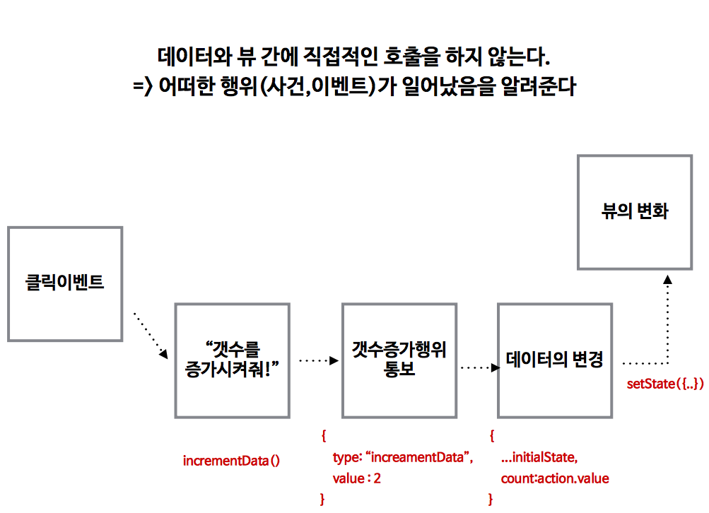
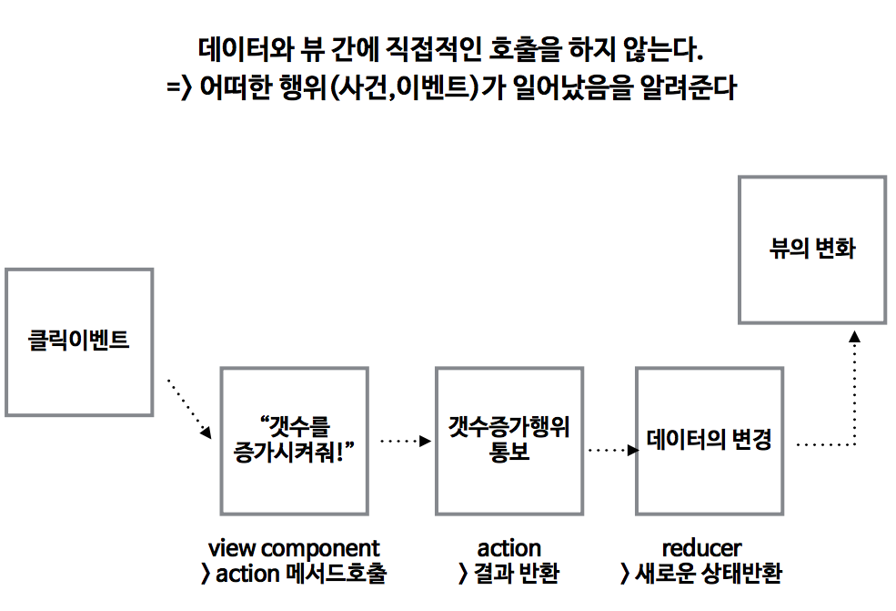
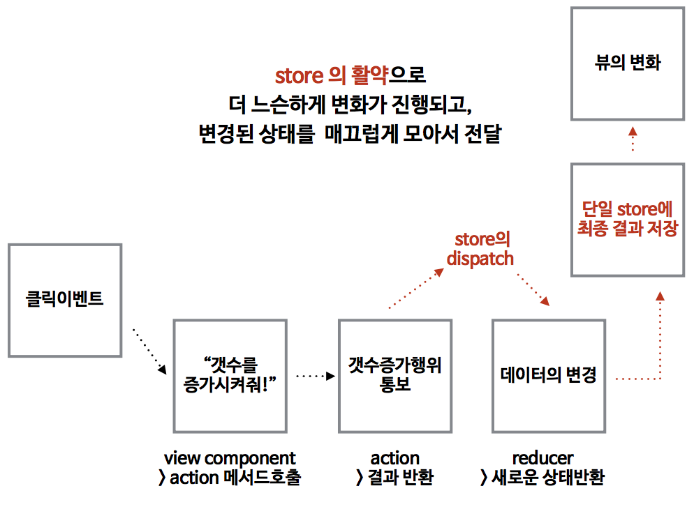

## REDUX

- redux는 페이스북이 공식적으로 밀어주는 것이 아니다.
- 프레임 워크는 항상 바뀐다. 
- Redux와 비교한 작은 프레임워크를 만들어 보는 것도 좋다.
- 꼭 쓸 필요는 없다.
- 뷰는 뷰 답게 !!!
- 데이터 흐름을 단방향 적으로 짠다 -> 복잡하지 않다. 하나의 흐름으로 유지 될 수 있도록
- 데이터가 어떻게 흐르는지 예측이 가능하다.
- 리덕스는 프레임워크 / 구조라 볼수 있다.
- 리덕스는 데이터를 다루기 위한 플러그 인이다.
- 절차가 조금 복잡할수 있따.

#### store / state
- Redux에서 데이터를 다루는 용어
- 데이터는 모두 store에 있다.
- 모두 하나의 store에서 관리 할것이다.
- 하나의 객체안에 모두 넣어 놓는다. 여기 저기에 있는 모든 데이터를 한곳에 모아 놓는다.
- 모든 데이터가 계층적으로 보관되어있다.

#### flux 구조

> - action : 어떤일이 일어났다는 사건, 개발자가 인지 하고 있어야 한다. 
> - dispatcher : 사건이 일어낫다고 store에 전달 (전달자!!!), 객체형태의 값을 전달해 준다. 
> - store : 데이터를 저장한다. 하지만 어떤 뷰가 바뀌었는지 모른다. 전부 Rerendering 한다. 특정 뷰만 바꾸지 는 않는다. (여기서 저장이 되는 건지? 아니면 바꿔 주기까지 하는 건지?) -> 이러한 문제를 redux에서는 reducer에서 상태값을 바꾼다. 상태값을 여러 reducer로 의미적으로 나누고 해당 의미에 맞는 reducer에서 바뀐 상태 값을 store에 저장을 하는 것이다. dispatch는 store에 있는 메소드이다.
> - view의 변화, 만약 어떤 사건이 있다면 다시 action으로 간다.

- 구현시에 store와 view의 관계가 복잡해진다. 
- store와 view와의 관계를 이해하는 것이 중요하다.
- 한반향으로 흐르는 것이 좋다. 잘 이해해 봐야 한다.
- 원론 적인 고민을 해야한다. 레이어가 많이 바뀌지 않는 app에서 redux를 꼭 쓸필요가 있는가?
- 굳이 사용할 필요가 없다. 
- 팀원 모두가 이해했을때 사용하는 것이 좋다.
- 팀원끼리 모두 이름, 함수, 순서 이런것을 모두 지키면서 해야한다. 모든 컨벤션을 정하고 시작해야한다. (import방식, es6/5 등 모든 것을 정하고 사용해야 한다.)
- Flux는 architecture 라 컨셉을 제공하는 역할을 하고, 실제 다양한 구현체가 등장. -> redux

#### REDUX 구조

그림 1

그림2

- state 값이 바뀌면 원래의 state값을 삭제(참조를 끊는다.)하고 새로은 state값을 만든다.
- dispatcher에 type object를 넘겨준다.
- 리듀서는 새로운 값을 복사해서 바뀐 값을 반환해 준다.
- store에 값을 저장한다.
- view에 변화를 준다.
- 프레임워크를 한번 만들어 보는 것은 좋다. (redux를 다양한 방법으로 구현할수 있다, 불편한 점을 생각해보고 바꿔 보는 시도가 필요하다.)
- 디자인 패턴은 실제 무언가를 만들어보면서 고민 하는 것이 좋다.
- 리듀서를 스토어 처럼 느낄것이다. 데이터 모델을 많이 다루기 때문에!!!

그림3

#### action / reducer / store

1. action
  - 함수다.
  - 무엇을 해야할지를 객체형태로 반환한다.
2. reducer
  - 함수다.
  - 데이터(state)에 변화를 실행시킨 후 변경된 데이터를 반환
  - 하나만 있지는 않다. 
  - 여러개 있을 경우 컴포넌트와 리듀서가 의미상 매치되도록 만든다.
3. store
  - action의 결과를 reducer로 전달한다. (dispatch 메서드를 통해)
  - dispatch 이외 유용한 메서드가 몇 개 더 있다
      - subscribe(callback) : state변화가 있을때 callback 함수를 실행시켜준다. 
      - getState() : 현재 store에 저장된 데이터(state)를 반환한다.
4. component의 state는 모두 store로 넘겨서 사용한다. Redux사용시 this.state를 거의 사용하지 않는다.

javascript
~~~Javascript
const { createStore } = Redux;

const todoReducer = (state = [], action) => {
  console.log(state, action);
  switch(action.type) {
    case 'ADDTODO':
      return [...state, action.todo];
    dafault: 
      return state;
  }
}

const store = createStore(todoReducer);

class InputComponent extends React.Component{
  
  constructor(props){
    super(props);
    this.addTodo = this.addTodo.bind(this);
  }
  
    addTodo(evt) {
      store.dispatch({
        type: 'ADDTODO',
        todo : evt.target.previousSibling.value
      })            
  }
  
    render(){
    //상위에서 보낸 getState()의 data값을 넘긴다. 
    let data = this.props.data;
    let listHTML = "";
    
    if(typeof data !== "undefined") {
      listHTML = data.map((v,i) => {
        return <li key={i}>{v}</li>
      });
    }
      return (
        

          <input type="text"/>
          <input type="button" onClick={this.addTodo} value="확인"/>
          

             {listHTML}
          

        

      );
  }
  
}

//state가 바뀔때마다 렌더링 되도록 만들어야 명시를 해주어야 한다.
const render = () => {
  console.log("render called");
  ReactDOM.render(
    //data를 getState()를 통해 가져온다.
    <InputComponent data={store.getState()} />,
    document.querySelector('#root')
  );
};

// 처음에는 render를 한번 실행 시켜 주어야 한다.
render();

// store에 값이 바뀌어 질때마다 바꾸어져야 한다.
store.subscribe(render);
~~~

html
~~~html

~~~

#### 6. 비동기
- 데이터를 비동기로 가져오고 콜백 함수에서 action을 발생 시킨다.
